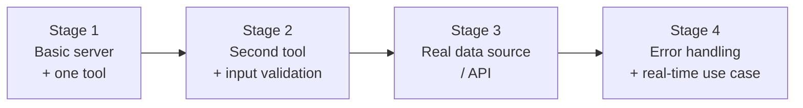

# MCP Explorer

A hands-on project for learning **MCP (Model Context Protocol)** by building both halves of the protocol ourselves — a server, then a client — one small, understandable step at a time.

> This README is also published as a browsable page: **[MCP Explorer](https://claude.ai/code/artifact/2ac1d88f-d347-40a2-ac23-1febc68554d0)**. It mirrors everything here — keep both in sync as the plan changes.

## MCP Server

This half of the project is the one built so far: a real MCP server, growing in stages.

### Overview

This repo starts as small as an MCP server can possibly be: one file, one tool, no extra layers. From there, it grows in stages — each one adding a single new concept (a second tool, input validation, a real API, error handling) until it looks like something you'd actually use.

The point isn't to rush to a "real" server. It's to build enough small, working versions that each new MCP concept has somewhere to attach itself in your head.

### What is MCP?

MCP (Model Context Protocol) is a standard way for an AI assistant to call out to external tools and data, instead of every app inventing its own custom integration. You write an **MCP server** that exposes a small set of capabilities — mainly **tools** (functions the assistant can call) — and any MCP-compatible client (Claude Desktop, Claude Code, etc.) can discover and use them the same way. Think of it like a USB port for AI assistants: one common plug, many different devices behind it.

### Initial Setup (Stage 1)

Stage 1 is deliberately as small as a working MCP server can be: a server with a single tool that adds two numbers.

#### Folder structure

```
MCP-Explorer/
├── .gitignore
├── README.md
├── package.json
├── tsconfig.json
└── src/
    └── index.ts
```

Here's why each piece exists — nothing here is optional scaffolding:

- **`package.json`** — the project's manifest. It declares *what this project needs to run* (the MCP SDK, plus `zod` for describing tool inputs) and *how to build/run it* (the `build` and `start` scripts). Without it, npm has no idea what to install.
- **`tsconfig.json`** — Node can't run `.ts` files directly, so this tells the TypeScript compiler (`tsc`) how to turn `src/*.ts` into plain JavaScript in `build/`. Notably `rootDir`/`outDir` keep source and compiled output cleanly separated.
- **`src/index.ts`** — the entire server. At this stage there's exactly one file because there's exactly one thing going on: create a server, give it one tool, connect it to a client.
- **`.gitignore`** — keeps `node_modules/` (reinstallable from `package.json`) and `build/` (regeneratable from `src/`) out of version control. Neither belongs in git history.

Nothing else exists yet — no `src/tools/` folder, no config layer, no test framework. Those would be answers to problems Stage 1 doesn't have.

#### Dependencies

- **`@modelcontextprotocol/sdk`** — the official library that implements the MCP protocol itself (message formats, the server object, the transport). Without it we'd be hand-writing JSON-RPC message handling.
- **`zod`** — a schema library. When we register the `add` tool, we use `zod` to say "this tool takes two numbers, `a` and `b`." The SDK uses that schema for two jobs at once: telling MCP clients what shape of input to send, *and* rejecting bad input at runtime.
- **`typescript`** / **`@types/node`** (dev-only) — the compiler itself, and type definitions for Node's built-in APIs, so the editor and compiler understand things like `process`.

> A note on `zod` here: giving the `add` tool a schema is not "Stage 2's input validation" — it's just how any MCP tool declares its shape, even the simplest one. Stage 2 (below) builds on top of this with *richer* validation: a custom rule with its own error message, not just a type.

#### The one tool: `add`

[`src/index.ts`](src/index.ts) does three things, in order:

1. **Create a server** — `new McpServer({ name, version })`. This is the object a client talks to.
2. **Register one tool** — `server.registerTool("add", { ...schema... }, handler)`. The handler receives already-validated `{ a, b }` and returns their sum as a text result.
3. **Connect a transport** — `StdioServerTransport`. "stdio" means the client talks to this process over its stdin/stdout, rather than over a network port. It's the simplest possible way to run an MCP server: the client just launches the process and starts writing/reading.

That's the whole mental model for Stage 1: **server → tool → transport**. Everything MCP does at a larger scale is built from these same three pieces.

### Stage 2 — Second tool + input validation *(this branch)*

Stage 2 adds one more tool, `divide`, specifically to show what validation looks like once "wrong type" isn't the only way a call can be bad.

#### Why `divide`, not something else

`add` only ever needed zod to describe a *shape*: two numbers, no further rules — any two numbers make a valid call. `divide` needs a *rule* on top of that shape: `b` can be any number except zero. That's exactly the distinction Stage 1's note above was pointing at — a business rule, not just a type.

```ts
b: z
  .number()
  .refine((value) => value !== 0, {
    message: 'b must not be zero — division by zero is undefined'
  })
  .describe('The denominator (must not be zero)')
```

`.refine()` layers a custom check on top of the base `z.number()` type check, with its own error message — that message is what the caller actually sees when the rule is broken.

#### What happens on bad input — verified, not assumed

Calling `divide` with `a: 10, b: 0` never reaches the handler function at all. The SDK validates arguments against the schema *before* your code runs, and returns this instead:

```json
{
  "content": [{ "type": "text", "text": "MCP error -32602: Input validation error: Invalid arguments for tool divide: b must not be zero — division by zero is undefined at b" }],
  "isError": true
}
```

Two things worth noticing here:
- **`isError: true`** — this is a *tool-level* error result, not a JSON-RPC protocol error and not a crash. The server keeps running; the client is just told this particular call failed, with a message tracing straight back to the `.refine()` message above.
- The handler's `console.error('[mcp-demo] divide called...')` never prints for this call. Validation genuinely happens before your code ever sees the input — you don't need to (and shouldn't) re-check `b !== 0` yourself inside the handler.

#### Try it yourself

Through the Inspector: call `divide` with `a: 10, b: 2` (works, returns `5`), then `a: 10, b: 0` (rejected, with the message above).

### How to Run

```bash
npm install
npm run build
npm start
```

`npm run build` compiles `src/index.ts` into `build/index.js`; `npm start` runs the compiled server. (There's also `npm run dev`, which just does both in one step.)

On its own, the server will print `mcp-demo server running on stdio` to stderr and then just sit there — that's expected, not a hang. Keep reading to see why, and how to actually talk to it.

### Understanding the Inspector

#### Why the server does nothing by itself

An MCP server never acts on its own — it only responds when a **client** sends it a request. Normally that client is a real AI assistant (Claude Desktop, Claude Code, etc.) deciding on its own when to call a tool. Since we don't have one of those wired up yet, we use the [MCP Inspector](https://modelcontextprotocol.io/docs/tools/inspector): a small web UI that plays the role of "the client" — except *you* click the buttons instead of an AI deciding to.

```
You (clicking buttons)  →  Inspector  →  your server (build/index.js)
```

Two things worth knowing about what's actually happening:

- Your server and its client talk in **JSON-RPC** — small JSON messages like `{"method":"tools/call","params":{"name":"add","arguments":{"a":2,"b":3}}}` — sent over the server process's **stdin**, with replies written back over its **stdout**.
- The Inspector is what actually *launches* your server and sends it those messages. The browser page itself doesn't speak MCP at all — it just tells the Inspector (via its own local proxy) what to send, and shows you what comes back.

#### Step by step: testing `add`

1. **Build the server** (from inside this project folder — the next command uses a relative path):
   ```bash
   npm run build
   ```
2. **Start the Inspector**, also from inside this folder:
   ```bash
   npx @modelcontextprotocol/inspector node build/index.js
   ```
3. It prints a URL with a security token, e.g. `http://localhost:6274/?MCP_PROXY_AUTH_TOKEN=<token>`. Open that exact URL. (The token just proves it's really you talking to your own local Inspector — it isn't part of MCP itself.)
4. Confirm **Command** is `node` and **Arguments** is `build/index.js`, then click **Connect**.
5. The **Tools** tab fills in by itself with `add` — that's the Inspector automatically calling `tools/list` right after connecting.
6. Click `add`, type numbers into `a` and `b`, click **Run Tool** — the sum comes back as the result.

#### One instance per connection — not the same as `npm start`

Every time you click **Connect**, the Inspector spawns a **brand-new copy** of your server — a separate running process from any `npm start` / `npm run dev` you might already have open elsewhere. Same code, but two independent instances that share nothing: nothing sent to one shows up in the other. If you're testing through the Inspector, the terminal running `npm start` isn't part of that loop at all — you can ignore it.

#### What you actually need running

To test a tool through the Inspector, this is the complete list — nothing else:

1. **The server is built** — `npm run build` has run at least once (and again after any edit), so `build/index.js` exists and is current.
2. **The Inspector is running** — from inside this folder: `npx @modelcontextprotocol/inspector node build/index.js`.
3. **The token is copied and pasted** — when it starts, the Inspector prints a URL like `http://localhost:6274/?MCP_PROXY_AUTH_TOKEN=<token>`. Copy everything after `TOKEN=` and paste it into the Configuration panel's **Proxy Session Token** field. Command/Arguments should be `node` / `build/index.js`.
4. **You've clicked Connect.**

Notice `npm start` / `npm run dev` isn't on that list. It's easy to assume "the server" needs to be running separately, but it doesn't — the Inspector builds nothing itself, but as long as `build/index.js` already exists on disk, it's entirely self-sufficient.

#### Where your own logs show up

The `add` handler logs each call:

```ts
console.error(`[mcp-demo] add called with a=${a}, b=${b}`);
```

This uses `console.error` (stderr), never `console.log` (stdout) — stdout is reserved for the JSON-RPC replies themselves, so anything else printed there would corrupt the protocol. The Inspector captures the spawned server's stderr and shows it inside its own UI — not in whatever terminal you happened to launch `npx @modelcontextprotocol/inspector` from.

### Roadmap

Every stage (and every side exploration) below gets its own git branch. The habit is: **branch → build → understand it → merge into `main` → branch again for the next thing.** Nothing moves to `main` until it's understood, not just working.

> **Branch numbering:** starting from this point, every new branch — a numbered stage or a side exploration — also gets a global sequence number prefix (`NN-description`), so the branch list alone shows true creation order, not just which stages happen to be numbered. `stage-1-basic-server` and `explore-mcp-client` predate this convention (they'd be #1 and #2) and keep their original names. Branch #3 turned out to be a side exploration too (`03-claude-md-constitution`, adding `CLAUDE.md`) rather than Stage 2 — proof the counter really is global and doesn't reserve numbers for stages in advance. Stage 2 is next in line and will be `04-stage-2-second-tool-validation`; anything after that gets whatever number comes next when it's actually created.



1. **Stage 1 — Basic server + one trivial tool** *(on `main`)*
   A server exists, and it can do exactly one thing (`add`). Goal: understand server / tool / transport as separate concepts.

2. **Stage 2 — Second tool + input validation** *(this branch, not yet merged)*
   Add a second, slightly less trivial tool, and lean harder on `zod` — rejecting bad input with clear errors rather than trusting the caller. Goal: see how multiple tools coexist, and what "validation" means beyond just typing.
   Branch: `04-stage-2-second-tool-validation`

3. **Stage 3 — Connect to a real data source / API**
   Swap a toy tool for one that does real (async) work — calling a public API or reading real data. Goal: handle async operations and things that can be slow or unavailable.
   Branch: `0N-stage-3-real-data-source` *(number assigned when created)*

4. **Stage 4 — Error handling & a real-time use case**
   Harden the server against failures (bad responses, timeouts, partial data) and add something closer to a genuine use case. Goal: go from "it works when everything goes right" to "it behaves sensibly when it doesn't."
   Branch: `0N-stage-4-error-handling-realtime` *(number assigned when created)*

Stages 1–2 are implemented; Stage 2 is on its own branch, waiting to be merged. Stages 3–4 above are the plan, not a promise of exact detail — it's normal for the specifics to shift once you're actually inside the previous stage's code.

### Next Steps

1. Run the server yourself (see **How to Run** above) and confirm both `add` and `divide` work through the Inspector — including `divide` correctly rejecting `b: 0`.
2. Once that makes sense, this branch is ready for a PR into `main`.
3. Start Stage 3 (a real data source / API) on the next numbered branch afterward.

If anything above didn't need to exist for `add` or `divide` to work, that's a sign it snuck in ahead of schedule — flag it before moving on.

## MCP Client

Everything under **MCP Server** covers one half of the protocol: a program that answers requests. The other half is a **client** — something that spawns a server, connects to it, and calls its tools. The Inspector (above) is one example of a client, but it's a pre-built tool with a UI. This side of the project is about writing a minimal client from scratch instead, in plain code, to see that half of the exchange directly.

**Status: built, on `main`.** This isn't one of the four numbered server stages — it was a separate, parallel exploration (originally `explore-mcp-client`, merged via [#2](https://github.com/shadmaanAsif/MCP-Explorer/pull/2)) for understanding the client side of MCP, and it's kept up to date as the server grows.

- **What it does:** [`src/client.ts`](src/client.ts) spawns `build/index.js` directly from code (no Inspector, no UI), connects to it, calls `listTools()`, then `callTool()` against both current tools — `add(2, 3)`, `divide(10, 2)`, and `divide(10, 0)` to show a validation rejection coming back as data (`isError: true`), not a thrown exception. Run it with `npm run client`.
- **Why it's worth doing:** it confirms the client/server relationship holds regardless of who's on the client end — a human clicking buttons, or a few lines of TypeScript. It's also a convenient scripted way to re-check both tools at once, without the Inspector's manual clicking.
